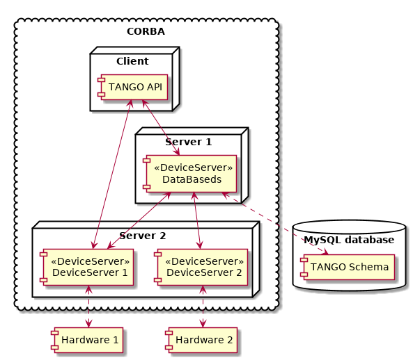

# Presentation plan

* TANGO Controls - introduction
* TANGO architecture
* Motivation and goals
* State of the Art
* TangoJS introduction
* TangoJS architecture
    * *core* (API)
    * *connector* (backend client)
    * *web-components* (widget toolkit)
* *Panel* application
* Summary

---

# TANGO Controls - introduction

* A software toolkit for controlling hardware in distributed environment,

* Built on top of **CORBA** with bindings for C++, Java and Python,

* *Device* in TANGO is a remote object that has:

    * attributes - *fields*, parameters of the device,
    * commands - *methods*, actions that device can perform,

* **GUI libraries based on Swing (ATK) and Qt (Taurus)**.

---

# TANGO Controls - architecture (simplified)

{ width=60% }

---

# TANGO Controls - graphical client application (Taurus)

{ width=80% }

---

# Motivation and goals

* Web technologies (HTML, JS, CSS) are extensively used for building modern
  GUI applications:
    * for web browser,
    * for desktop (Github Electron),
    * for mobile (Apache Cordova),

* Benefits:
    * hundreds of frameworks,
    * thousands of libraries and reusable components,
    * fast prototyping,
    * ease of deployment,

* But it is not possible to create native web-based TANGO clients,

* **Goal: Provide an extensible, standard-based solution for building TANGO
  clients for web browsers**.

---

# State-of-the-art

* Canone
    * PHP and Python on server side,
    * limited interaction options,
    * first release in 2005, discontinued in 2007,

* Taurus Web - TANGO over
    * WebSocket gateway for TANGO (implemented in Python),
    * almost no frontend code,
    * discontinued at proof-of-concept stage

* Tango REST
    * RESTful API for TANGO,
    * server written in Java, no frontend code

---

# State-of-the-art (continued)

* mTango (<https://bitbucket.org/hzgwpn/mtango>):
    * actively developed since 2013,
    * RESTful gateway to TANGO (Java servlet),
    * Javascript client,
    * collection of UI components.

* However, the frontend part has some drawbacks:
    * depends on JavascriptMVC (old version of unpopular framework),
    * uses JsonP (instead of CORS requests),
    * requires Java and Rhino runtime (instead of Node.js),
    * provides just basic widgets,
    * it is hard to learn and get started.

---

# TangoJS introduction

* *Modular, extensible, framework-agnostic __frontend__ stack for TANGO
  Controls*,

* Uses modern web standards: ES2015, Web Components, CSS3,

* Works with (or without) any framework,

* Pluggable backends for communication with TANGO (may be integrated with
  mTango),

* Can run in Node.js (API only) and all major browsers (API + widgets),

* Built with Node, available in npm, can be easily integrated into existing
  Node projects.

---

# TangoJS architecture

{ width=80% }

---

# TangoJS architecture - *core* (API)

* Tango API for Javascript,

* Interface similar to jTango (Tango API for Java),

* Enums, constants and structures generated from TANGO IDL:
    * consistent with whole TANGO ecosystem,

* Backend-agnostic:
    * all calls are passed to the underlying
      connector,

* Written with ES2015 - maintainable, clean design, modular code,

---

# TangoJS architecture - *connector* (backend client)

* A plugin for accessing TANGO infrastructure,

* integrates browser with TANGO,

* default connector uses mTango on server side,

* *mtango-connector* client is implemented with Fetch API,

* requires mTango to be configured with CORS support,

* possible other implementations (e.g. with WebSocket),

* responsible for user authentication and authorization.

---

# TangoJS architecture - *web-components*

* A collection of widgets inspired by Taurus library,

* Built with *Web Components*:
    * *Custom Elements*, *HTML Imports*, *Shadow DOM*,
    * Each widget is a self contained entity,
    * Widgets may be loaded on demand,

* Available widgets:
    * `tangojs-label`
    * `tangojs-line-edit`
    * `tangojs-command-button`
    * `tangojs-state-led`
    * `tangojs-trend`
    * `tangojs-form`
    * `tangojs-device-tree`

---

# TangoJS architecture - *web-components* (continued)

* Create components declaratively:

```html
<tangojs-trend
  model="sys/tg_test/1/double_scalar"
  poll-period="1000"
  data-limit="20">
</tangojs-trend>
```

* Or using DOM APIs:

```javascript
const le = document.createElement('tangojs-line-edit')
le.setAttribute('model', 'sys/tg_test/1/long_scalar_w')
le.pollPeriod = 1000 // reflected properties
le.showName = true
```

---

# *Panel* application


---

# Summary

* Objectives have been achieved:
    * TangoJS allows for building *adaptive* web-based client applications,
    * widget's layout may be controlled via media queries and adapted to the
      environment,
    * operator may adapt the UI interactively using the TangoJS Panel application,

* Solution is extensible:
    * new widgets may be added in future,
    * new ways of communication with TANGO may be implemented (requires changes
      only in connector),

* Positive feedback from NSRC Solaris and TANGO community,

* Work presented at KUKDM'16.

---

# Thank you
