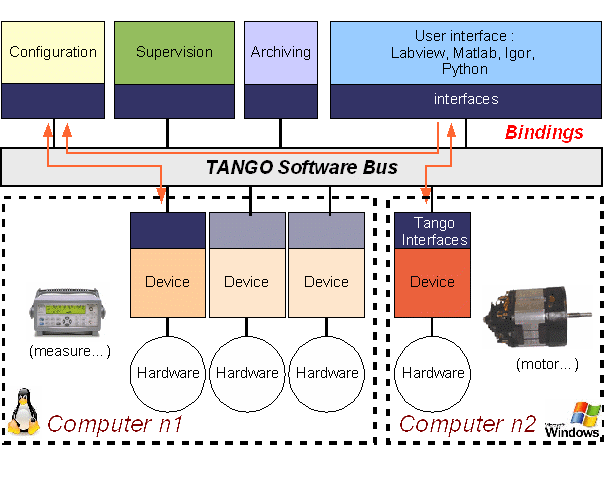
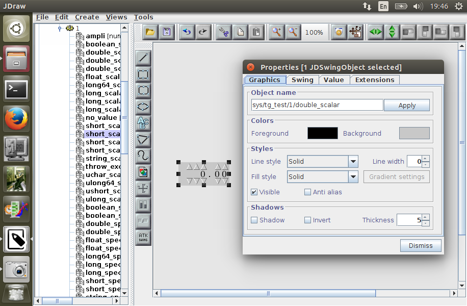

# Agenda

1. (Brief) Introduction to TANGO Controls
     1. Core
     1. GUIs
1. Thesis goal
1. Objectives

---

# TANGO

http://www.tango-controls.org/

* A software toolkit for controlling hardware in distributed environment,
* built on top of CORBA,
* with bindings for C++, Java and Python.

Main purpose: controlling accelerator-related systems  
in physics experiments.

Sites using TANGO:

* ESRF (France), SOLEIL (France), MAX-IV (Sweden), SOLARIS (Poland)
* and many others ...

---

# Tango architecture

http://iramis.cea.fr/en/Phocea/Vie_des_labos/Ast/ast_sstechnique.php?id_ast=177

---

# Tools

* GUI frameworks
    * ATK (Java, Swing)
    * Taurus (Python, Qt)
    * QTango (C++, Qt)
* administrative tools
    * Jive
    * Astor

Applications with specific requirements may be:

* developed from a scratch with above frameworks,
* designed with JDraw (GUI designer),
* designed and modified at runtime with Taurus toolkit

---

# JDraw - drag-and-drop GUI designer:

---

# Taurus - *panels* may be modified at runtime:

---

# Thesis aims

Only desktop client apps are currently supported.

## Main goal

**Move TANGO to the Web**

... and build Taurus-like application for SOLARIS

---

# Why web applications?

* easy to develop,
* cheap to maintain,
* multiplatform,
* available on PCs, tablets, terminals  
  (low deployment cost).

---

# Existing solutions:

* [mTango](https://bitbucket.org/hzgwpn/mtango/overview) -
  RESTful interface for TANGO
  * JS frontend highly tied to their technology stack

* [Canone](http://www.tango-controls.org/resources/documentation/guis/canone/) -
  HTML + PHP + Python (for TANGO access)
  * discontinued in 2007, used by nobody

* [Taurus Web](http://www.taurus-scada.org/en/stable/devel/api/taurus/web.html) -
  TANGO over WebSockets
  * discontinued *proof-of-copcept*

* ... and a few more proofs-of-concept, works-in-progress  
  and dead projects

**None suit our needs.**

---

# Objectives

1. Find a way to integrate CORBA middleware with browser technologies,
1. Stick to the standard TANGO interfaces (defined in IDL),
1. Design and develop presentation layer:
    * extendable collection of widgets,
    * not tied to any web-framework,
1. Handle communication in a secure way,
1. Become a *de-facto-standard* for developing TANGO
   web-applications.

---

# Thank you

Q&A time.
