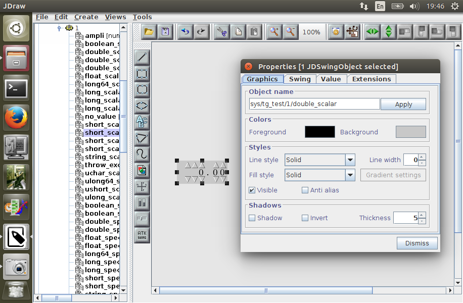
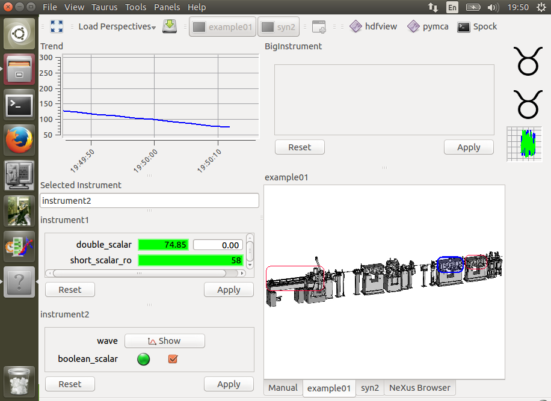

## Adaptive web user interfaces for TANGO Control System

*MSc thesis P1*

Michal Liszcz

Supervisor:  
Wlodzimierz Funika

Collaboration:  
National Synchrotron Radiation Centre SOLARIS

2015-11-04

---

## TANGO

http://www.tango-controls.org/

* A system for controlling hardware in distributed environment,
* built on top of CORBA,
* with bindings for C++, Java and Python.

Main purpose: controlling accelerator-related systems  
in physics experiments. <!-- .element: style="margin:1.5em" -->

Sites using TANGO:
* ESRF (France), SOLEIL (France), MAX-IV (Sweden), SOLARIS (Poland)
* and many others ...

http://iramis.cea.fr/en/Phocea/Vie_des_labos/Ast/ast_sstechnique.php?id_ast=1776

---

## Tools

* GUI frameworks
  * ATK (Java, Swing)
  * Taurus (Python, Qt)
  * QTango (C++, Qt)
* administrative tools
  * Jive
  * Astor

Applications with specific requirements may be:
* developed from a scratch with above frameworks,
* designed with JDraw (GUI designer),
* designed and modified at runtime with Taurus toolkit

---

## Any web-tools?

Like Taurus or JDraw - nope.

#### Existing solutions:

* [mTango](https://bitbucket.org/hzgwpn/mtango/overview) -
  RESTful interface for TANGO
  * JS frontend highly tied to their technology stack

* [Canone](http://www.tango-controls.org/resources/documentation/guis/canone/) -
  HTML + PHP + Python (for TANGO access)
  * discontinued in 2007, used by nobody

* [Taurus Web](http://www.taurus-scada.org/en/stable/devel/api/taurus/web.html) -
  TANGO over WebSockets
  * discontinued *proof-of-copcept*

* ... and a few more proofs-of-concept, works-in-progress  
  and dead projects

---

## Thesis aims

* Build Taurus-like application for web browsers:
  * which is easily modifiable by operator,
  * uses modern Javascript APIs,
  * supports multiple backends (mTango, Taurus Web, ...),
  * code solid and well-tested.

* Deploy the application at SOLARIS.

---

## Objectives

0. Develop Javascript equivalent of TANGO API:
  * `DeviceProxy`, `DeviceAttribute`, etc.

0. Add support for pluggable backends and protocols:
  * mTango
  * HTTP, WebSocket

0. Develop set of HTML widgets:
  * HTML5, vanilla JS (ES6)
  * framework-agnostic

0. Glue everything together.

0. Make these things secure.

---

## Thank you

Q&A time.
