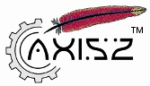
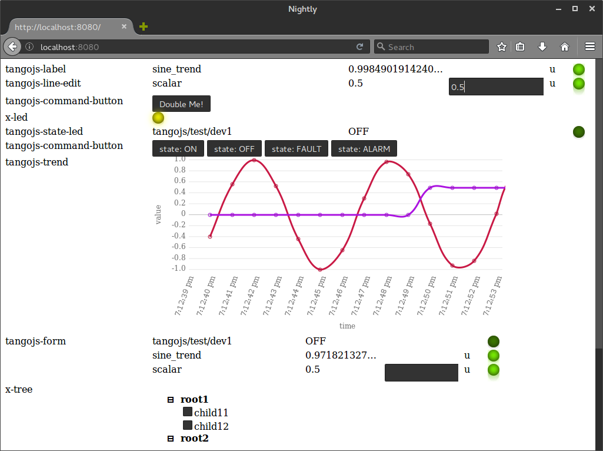
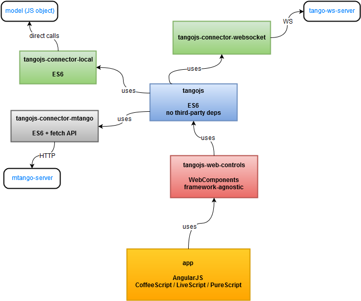

# Implementation status

* done:
    * `idl2js` translator
    * `tangojs`
    * `tangojs-connector-local`
    * `tangojs-web-components` (80%)

---

# `idl2js` translator / code generator

\columnsbegin
\column{.7\textwidth}

* translates CORBA IDL *interfaces*, *structures*, *enums* into corresponding
Javascript entities
* written in Scala
* uses Apache Axis2 IDL parser
* <https://github.com/mliszcz/idl2js>

\column{.3\textwidth}

\columnsend

---

# `tangojs` - Tango API for Javascript

\columnsbegin
\column{.7\textwidth}

* interface similar to jTango  
  (Tango API for Java)
* enums and constants consistent with whole Tango ecosystem
* backend-agnostic
* <https://github.com/mliszcz/tangojs>
* API docs: <http://mliszcz.github.io/tangojs/>

\column{.3\textwidth}

\columnsend

---

# `tangojs-connector-local` - example connector

* in-memory backend mock
* for testing and demo purposes
* *database* / device tree is represented as a plain-old JS object
* <https://github.com/mliszcz/tangojs-connector-local>

---

# `tangojs-web-components` - Tango widget toolkit

* influenced by Taurus
* built with WebComponents:
    * Custom Elements, HTML Imports, Shadow DOM
* widgets:
    * `tangojs-label`
    * `tangojs-line-edit`
    * `tangojs-command-button`
    * `tangojs-state-led`
    * `tangojs-trend`
    * `tangojs-form`
        * adapts to bound model
    * `tangojs-device-tree`
* <https://github.com/mliszcz/tangojs-web-components>

---

# `tangojs-web-components` - Tango widget toolkit

\columnsbegin
\column{.8\textwidth}

\columnsend

---

# Recap: `tangojs` stack

\columnsbegin
\column{.8\textwidth}

\columnsend

---

# TODOs

* `tangojs-panel`
    * work in progress
    * web application
    * ECMAScript 2015
    * Angular JS (or Vanilla JS ?)
    * Bootstrap 4
* thesis text
    * chapter 2 in progress
        * (chapter 1 not started!)

---

# Thank you

Your questions?.
