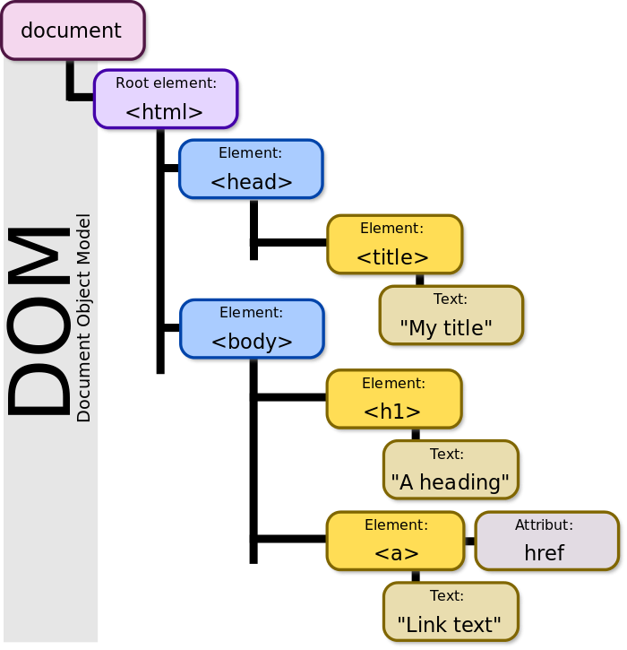
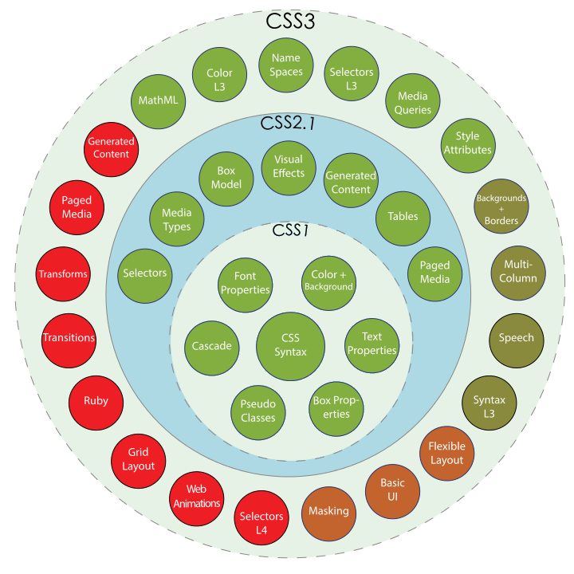
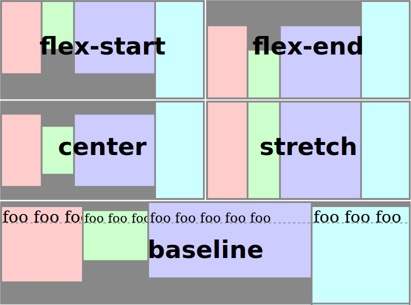
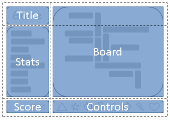

# Introduction

## HTML

* stands for HyperText Markup Language,
* describes the structure and the semantic content of a web document,
* web page is constructed from HTML elements such as `<div>`,
* standard maintained by The World Wide Web Consortium (W3C),
* October 28, 2014 - HTML5 was published as a W3C Recommendation.

* <https://developer.mozilla.org/en-US/docs/Web/HTML>

## DOM

* stands for Document Object Model,
* programming interface for HTML (and SVG and XML) documents,
* provides a structured representation of the document as a tree,
* programs can change the document structure, style and content via DOM
  manipulation APIs.

> HTML is text and the DOM is the in-memory object model to represent the tree
  that the HTML described.

* <https://developer.mozilla.org/en-US/docs/Web/API/Document_Object_Model/Introduction>

---



## CSS

* stands for Cascading Style Sheet,
* used to describe the presentation of a document,
* CSS2.1 - W3C recommendation,
* CSS3 - split into smaller modules.

> The basic goal is to allow a browser engine to paint elements of the page
  with specific features, like colors, positioning, or decorations.

* <https://developer.mozilla.org/en-US/docs/Web/CSS>

## Javascript

* standardized by Ecma International in ECMAScript specification
  (ECMAScript 2015 is the latest release),
* *de-facto standard* for client-side scripting in web browsers,
* object-oriented, prototype-based,
* with support for functional programming,
* thousands of *X-to-Javascript* compilers available,
* Javascript, JavaScript, ECMAScript, SpiderMonkey, V8 - all these terms refer
  to diffrent things.

## Standardization bodies

* World Wide Web Consortium

* <https://www.w3.org/>

* Specification development:
    * Editor Draft
    * Working Draft
    * Candidate Recommendation
    * Recommendation

* Standards:
    * DOM Level 4: <https://www.w3.org/TR/dom/>,
    * HTML5: <https://www.w3.org/TR/html5/>,
    * and many others.

# ECMAScript 2015

## Features (1/5)

* extended standard library:
    * `Map`, `Set`, `WeakMap`, `WeakSet`,
    * `Promise`,
    * `Symbol`,
    * `Proxy`
* spread operator / destructuring
    ```javascript
    [first, second, ...rest] = [1,2,3,4,5]
    ```
* default parameters
* rest parameters

## Features (2/5)

* template literals
    ```javascript
    `can contain ${variables}
    and span over multiple lines`
    ```
* generators
* block-scoped declarations
    * `let`, `const`, `function`
* shorthand names in initializers
    ```javascript
    const field = 1
    const object = { field }
    ```

## Features (3/5)

* tail-call-optimization
* arrow functions
    * lexical `this` scoping
    ```javascript
    function () {
      const that = this
      setTimeout(() => {
        this === that // true
      })
    }
    ```

## Features (4/5)

* classes
    ```javascript
    class MyClass extends AnotherClass {
      constructor (value) {
        super(value)
      }
      method () {
        // implementation
      }
    }
    ```

## Features (5/5)
* modules
    ```javascript
    export const MyClass = MyClass

    export let mySharedVal = 1

    export MyClass2 { /* definition */ }

    export function myFunc (x, y) { /* body */ }

    import { MyClass2, mySharedVal } from './my/module'
    import * as data from './data'
    ```

## Browser support

* https://kangax.github.io/compat-table/es6/
* works in all evergreen browsers
* % of implemented features:
    * *Babel* transpiler - 74%
    * Firefox 45 - 85%
    * Firefox 48 - 90%
    * Chrome 49 - 91% (Opera 36)
    * Chrome 51 - 96% (Opera 38)
    * Edge 13 - 79%
    * Edge 14 - 85%
    * Safari 9 - 53%

# CSS3 and beyond

## History

* 7 June 2011 - W3C Recommendation for CSS2.1,
* CSS3:
    * split into modules, evolves independently,
    * each iteration produces new *level* which builds upon previous one,
    * Recommendations:
        * Selectors Level 3 (general sibling combinator `~`),
        * Media Queries (`@media(...)`),
        * CSS Color Module Level 3 (`rgba(...)`, `hsla(...)`),
        * and many others.

---



## CSS Selectors Level 4

* <https://drafts.csswg.org/selectors-4/>
* validity pseudo-classes: `:valid`, `:invalid`
* `:matches(...)` pseudo-class
    ```css
    :matches(*:hover, *:focus)
    ```
* `:not(...)` and `:has(...)` - **parent selector**!
    ```css
    a:has(> img)
    section:not(:has(h1, h2, h3, h4, h5, h6))
    li:has(> a.active) {
      /* styles to apply to the li tag */ }
    ```
* `:root` pseudo-class
* and more ...

## CSS Custom Properties for Cascading Variables Module Level 1

* <https://www.w3.org/TR/css-variables-1/>,
* custom properties prefixed with `--*`,
* and referenced with `var(...)` syntax,
    ```css
    :root {
      --main-color: #06c;
      --accent-color: #006;
    }

    #foo h1 {
      color: var(--main-color);
    }
    ```

## CSS Values and Units Module Level 3

* <https://www.w3.org/TR/css3-values/>,
* mathematical expression (`calc(...)`)
    ```css
    section {
      float: left;
      margin: 1em; border: solid 1px;
      width: calc(100%/3 - 2*1em - 2*1px);
    }
    ```
* attribute references (`attr(...)`)
    ```css
    stock > * {
      display: block;
      width: attr(length em); /* default 0 */
      height: 1em;
    }
    ```

## CSS Conditional Rules Module Level 3

* <https://drafts.csswg.org/css-conditional-3/>,
* <http://www.w3.org/TR/mediaqueries-4/>,
* extended media queries
    ```css
    @media screen and (color), projection and (color) {
      /* page is displayed on a screen/projector
       with color support */
    }
    ```
* feature queries
    ```css
    @supports ( display: flex ) {
      /* use flexbox here */
    }
    ```

## CSS @apply rule

* <https://tabatkins.github.io/specs/css-apply-rule/>
    ```css
    :root {
      --toolbar-title-theme: {
        color: green;
      };
    }

    .toolbar > .title {
      @apply --toolbar-title-theme;
    }
    ```

## CSS @extend rule

* <https://tabatkins.github.io/specs/css-extend-rule/>
    ```css
    .error {
      color: red;
    }

    .serious-error {
      @extend .error;
      font-weight: bold;
    }
    ```

## CSS Flexible Box Layout Module Level 1

* <https://www.w3.org/TR/css-flexbox-1/>,
* <https://css-tricks.com/snippets/css/a-guide-to-flexbox/>,
    ```css
    .root {
      display: flex;
      flex-direction: column;
    }
    .root > * {
      flex: 1;
    }
    ```

---



## CSS Grid Layout Module Level 1 (1/4)

* <https://www.w3.org/TR/css-grid-1/>,
* <http://gridbyexample.com/examples/>,
* divides space into rows and columns (both explicit and implicit),
* can be easily styled with media-queries,
* is source order independent,
* no nested selectors - simple DOM.

## CSS Grid Layout Module Level 1 (2/4)



## CSS Grid Layout Module Level 1 (3/4)

```css
#grid {
  display: grid;

  grid-template-areas: "title stats"
                       "score stats"
                       "board board"
                       "ctrls ctrls";

  grid-template-columns:
    auto minmax(min-content, 1fr);

  grid-template-rows:
    auto auto minmax(min-content, 1fr) auto
}
```

## CSS Grid Layout Module Level 1 (4/4)

* placement by area:
    ```css
    #title { grid-area: title }
    ```
* by numeric coordinates and spane:
    ```css
    #A { grid-column: 1 / span 2; grid-row: 2;}
    ```
* or may be handled automatically by grid-placement algorithm.

# Web Components

## Introduction

TODO

## HTML Templates

* included in HTML5 standard,
* <https://www.w3.org/TR/html5/scripting-1.html#the-template-element>

## HTML Imports

TODO

## Custom Elements

TODO

## Shadow DOM

TODO

# Summary

## Hands-on lab

1. clone the repo: <https://github.com/mliszcz/agh-webcomponents-tutorial>

1. run the example (you need Firefox 45+ or Chrome ~49 and Node.js)

## Thank you
