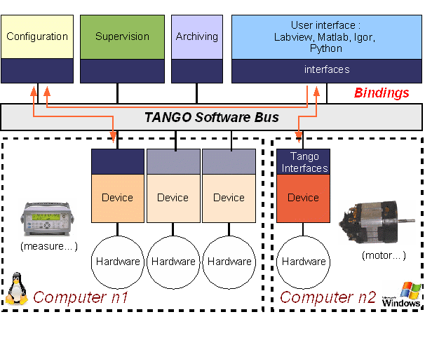
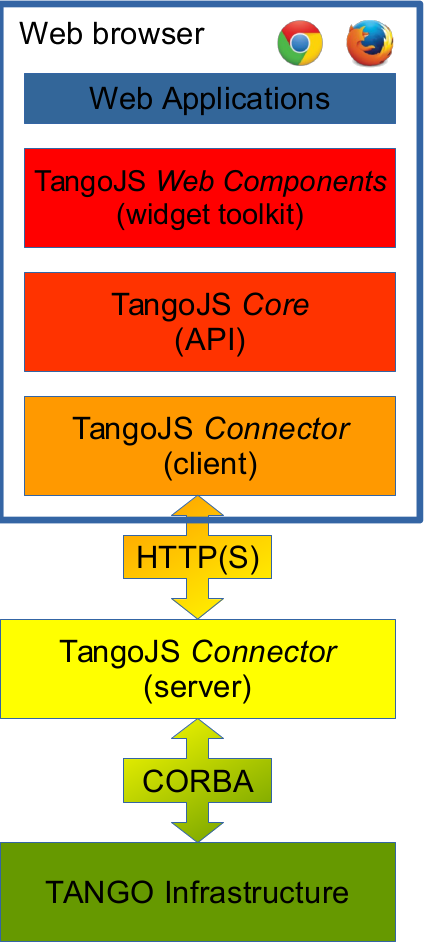

# Agenda

1. (Brief) Introduction to TANGO Controls
1. Goals and objectives
1. Solution

---

# TANGO

http://www.tango-controls.org/

* A software toolkit for controlling hardware in a distributed environment,
* built on top of CORBA and ZeroMQ,
* with bindings for C++, Java and Python.

**Main purpose**: controlling hardware in synchrotron radiation facilities.

Sites using TANGO:

* ESRF (France), SOLEIL (France), MAX-IV (Sweden), SOLARIS (Poland)
* and many others ...

---

# Tango architecture

http://iramis.cea.fr/en/Phocea/Vie_des_labos/Ast/ast_sstechnique.php?id_ast=177

---

# Motivation

* CORBA (and TANGO) clients cannot run in a web browser;
* web-based approach has become crucial in building **accessible** and
  **adaptive** GUI applications, thanks to:
    * rapid development and prototyping,
    * ease of deployment,
    * great tooling support.

---

# Taurus GUI Toolkit - UI may be modified at runtime:

---

# Goals

1. Provide API for accessing TANGO infrastructure from a web browser
  (using ordinary Javascript);
1. Use standard TANGO interfaces and entities (defined in IDL);
1. Design extensible, framework agnostic, declarative widget toolkit
     * input fields, plots, etc.
1. Utilize modern web standards, with no third-party dependencies.

---

# TangoJS stack

---

# Thank you

Q&A time.
